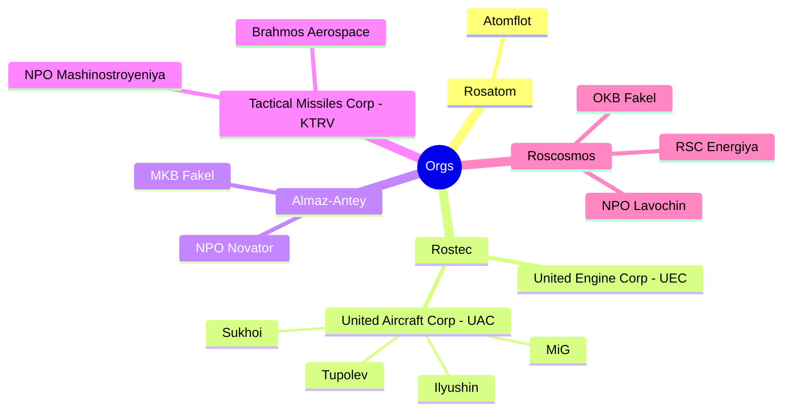

# Aerospace And Marine Missiles (A2M2)

* Poseidon UUV 
* 9M730 Burevestnik (N-Powered N-Armed Cruise Missile)
* Kh-47M2 Kinzhal ALBM
* 3M22 Zircon HCM
* Avangard HGV
* RS-28 Sarmat ICBM (HGV-capable & FOBS-capable)
* Oreshnik IRBM
  * R-26 Rubezh IRBM
* RT-2PM2 Topol-M ICBM
* Proton-M HLV (Heavylift Launch Vehicle)

