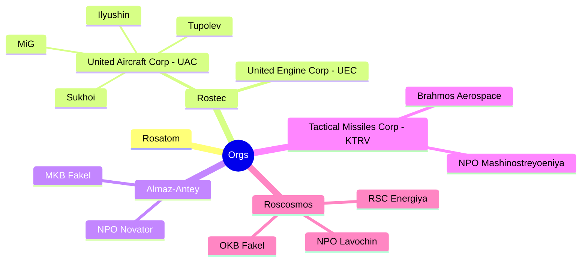

# Aerospace And Marine Missiles (A2M2)

* Poseidon UUV 
* 9M730 Burevestnik
* Kh-47 Kinzhal
* 3M22 Zircon HCM
* Avangard HGV
* RS-28 Sarmat ICBM (Can be used as FOBS. Can carry HGV)
* Oreshnik IRBM
  * R-26 Rubezh IRBM
* RT-2PM2 Topol-M ICBM
* Proton-M HLV (Heavylift Launch Vehicle)

