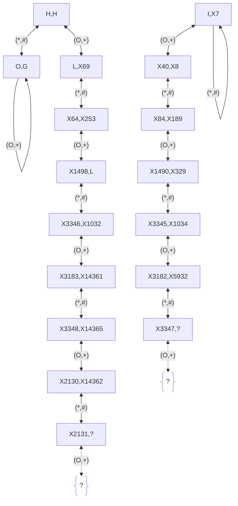

# Triangle Formulas for Angles

- $\angle BIC = 90^º + \dfrac{A}{2}$
- $\angle BGC$ No formula since $G$ is an affine object. $G$ is affine-invariant and does not play nice with angles.
- $\angle BOC = 2A$
- $\angle BHC = 180^º - A$

<!--img width="691" alt="Orthic Triangle" src="https://github.com/user-attachments/assets/5aebd298-5d6b-4850-ac37-47229b98b945" /-->

- In an Orthic Triangle (See Figure)
  - $\angle H_cH_aH_b = 180^º - 2A = 2\theta$
  - Line $\overline{HH_a}$ bisects $\angle H_cH_aH_b$. Hence $H$ is the Incenter of the Orthic Triangle.

---

# Formulas for Distances of $O$, $G$, $I$, $H$ from a Vertex. Also Formulas for Their Cevian[^1] Lengths

---
🟠
- $\overline{AO} = R$
- $\overline{OO_a} = R \dfrac{\cos A}{\cos (B-C)}$
- $\overline{AO_a} = \overline{AO} + \overline{OO_a}$
- $\overline{OM_a} = R\\, \cos A = \dfrac{1}{2}\overline{AH}$

---
🟢
- $\overline{AG} = \dfrac{2}{3} \overline{AM_a}$
- $\overline{GM_a} = \dfrac{1}{3} \overline{AM_a}$
- $\overline{AM_a} = \dfrac{1}{2}\sqrt{2b^2 + 2c^2 - a^2}$

---
🟣
- $\overline{AI} = 4R\\: \sin \dfrac{B}{2} \\: \sin \dfrac{C}{2}$
- $\overline{II_a} = \overline{AI_a} - \overline{AI}$
- $\overline{AI_a} = \dfrac{2bc}{b+c} \cos \dfrac{A}{2}$
- $\dfrac{\overline{BI_a}}{\overline{CI_a}} = \dfrac{c}{b}$

---
🔴
- $\overline{AH} = 2R\\: \cos A$
- $\overline{HH_a} = 2R\\: \cos B\\: \cos C$
- Height $$h_a = \overline{AH_a} = 2R\\: \sin B\\: \sin C = \dfrac{2\Delta}{a}$$

---

🟠🔴

$\therefore \\; \overline{OM_a} = R\\, \cos A = \dfrac{1}{2}\overline{AH}$

---

## Formulas for Exradius and Inradius[^2][^3]

- $r_a^{-1} + r_b^{-1} + r_c^{-1} = r^{-1} = h_a^{-1} + h_b^{-1} + h_c^{-1}$
- $r_a + r_b + r_c = 4R + r$
- $rr_ar_br_c = \Delta ^2$
  - $\because \\:\\:  r = \dfrac{\Delta }{s} \\:\\:$, $r_a = \dfrac{\Delta }{s-a}\\:$ and so on.

## Formulas for Distances Amongst $O$, $G$, $I$, $H$

- 🟣🟢 $\overline{IG} =$ See [^18][^19][^20]
- 🟣🟠 $\overline{IO} = \sqrt{R^2 - 2Rr}$ [^20][^21][^33]
- 🟣🔴 $\overline{IH} = \sqrt{2r^2 - 4R^2 \\: \cos A \\: \cos B \\: \cos C}$ [^22]
- 🟠🔴 $\overline{OH} = R\sqrt{1 - 8\\: \cos A \\: \cos B \\: \cos C} = 3R\sqrt{1 - \dfrac{a^2+b^2+c^2}{9R^2}}$

> [!NOTE]
> And, we already know:[^32]
> - 🟢🟠 $\overline{GO} = \dfrac{1}{3}\overline{OH}$
> - 🟢🔴 $\overline{GH} = \dfrac{2}{3}\overline{OH}$

---

# Pedal Triangle[^4], Pedal Circle[^5], Cevian Triangle[^6], Polar Triangle[^26]

- Radius of Pedal Circle of a point $P$\
  $$r_P = \dfrac{\overline{PA}.\overline{PB}.\overline{PC}}{2(R^2 - \overline{PO}^2)}$$

> [!NOTE] 
> Notation:
> 
> $P$ = A Point. $P(\tau)$ = A Point $P$ with Trilinear coordinates $(\tau_1, \tau_2, \tau_3)$.
>
> $`P^*`$ = Isogonal Conjugate of $P$.[^7][^31]
>
> $P^+$ = Isotomic Conjugate of $P$.[^8]
>
> $P^\\#$ = Cyclocevian Conjugate of $P$.[^9] = $`((((P^+)^©)^*)^@)^+`$[^37]
>
> $P^@$ = Anticomplement of $P$.[^34]
>
> $P^©$ = Complement of $P$.[^35]

<!-- iframe scrolling="no" title="Isogonal Conjugates PedalT CevianT Orthologic" src="https://www.geogebra.org/material/iframe/id/etp8ypns/width/1468/height/746/border/888888/sfsb/true/smb/false/stb/false/stbh/false/ai/false/asb/false/sri/false/rc/false/ld/false/sdz/false/ctl/false" width="1468px" height="746px" style="border:0px;"> </iframe -->

<!-- ggb_applet id="etp8ypns" width="1468" height="746" border="888888" /-->

- Pedal Triangles of $P$ and $`P^*`$ share the same circumcircle.
  - Its center is the midpoint of $P$ and $`P^*`$. But diameter $\neq \overline{PP^*}$.
  - Converse is also true. Two points with a common Pedal Circle, must be isogonal conjugates. This can be proved by contradiction since at most two points can have a commom Pedal Circle.
    - Because one side of a triangle is a straight line which can cut a circle in at most two points.
    - Therefore, also, at most two points can have a common Cevian Circle.
- Cevian Triangles of $P$ and $P^+$ $\color{red}DO$ $\color{red}NOT$ share the same circumcircle. ‼️Check this[^23]‼️.[^38]
- Cevian Triangles of $P$ and $P^\\#$ share the same circumcircle (by definition).[^9][^40]

- Also, the 3 Cevians of one isogonal conjugate are $\perp$ to the 3 corresponding sides, respectively, of the Pedal Triangle of the other isogonal conjugate.[^30]. That means, for any $P$, the Cevian Triangle of $`P^*`$ and the Pedal Triangle of $`P`$ are Orthologic[^44]. Their Orthology Centers[^45] are $`P^*`$ and another point which is not $P$. $\color{red}!!TODO:\\: Find\\: the\\: identity\\: of\\: this\\: point!!$ The concurrency point of the 3 $\color{green}GREEN$ lines (in [^47]) which is the orthology center of $\Delta A_1B_1C_1$ (Pedal Triangle of $P$) wrt $\Delta A_2B_2C_2$ (Cevian Triangle of $`P^*`$). See [^47]. Note: The orthology center of $\Delta A_2B_2C_2$ wrt $\Delta A_1B_1C_1$ is $`P^*`$.
  - Note: Also, for any Triangle $ABC$, and point $P$, $\Delta ABC$ and Pedal Triangle of $P$ are Orthologic with Orthology Centers $`P^*`$ and $P$.[^46]
  - Also, Orthology is a reflexive ($\Delta ABC$ is Orthologic with itself with Orthology Center as $H$)[^48], symmetric, but $\color{red}NOT$ a transitive relation. If $\Delta ABC$ and $\Delta A_1B_1C_1$ are orthologic, and $\Delta A_1B_1C_1$ and $\Delta A_2B_2C_2$ are orthologic, then it does $\color{red}NOT$ imply $\Delta ABC$ and $\Delta A_2B_2C_2$ are orthologic.[^47]

- $P(\tau)$ is the Perspector[^27] of the reference $\Delta ABC$, its Cevian Triangle, and the Polar Triangle of $\sum \dfrac{\tau}{x}=0$.
  - The Polar Triangle of $\sum \dfrac{\tau}{x}=0$ is the same as the Anticevian Triangle of $P(\tau)$.
  - If $P(\tau)$ lies inside the Medial Triangle, its Anticevian Triangle ie the Polar Triangle of $\sum \dfrac{\tau}{x}=0$, circumscribes the reference $\Delta ABC$.
  - Otherwise, the Anticevian / Polar Triangle won't circumscribe the reference $\Delta ABC$. Because, at least one of the 3 vertices $A$, $B$, $C$ will lie on the ***extended*** side(s) of the Anticevian / Polar Triangle.
- The Trilinear Polar[^29] of $P(\tau)$ ie $\sum \dfrac{x}{\tau} = 0$ is the Perspectrix[^28] of all these Triangles ($\Delta ABC$, $P(\tau)$'s Cevian Triangle, and Polar Triangle of $\sum \dfrac{\tau}{x}=0$, which is $P(\tau)$'s Anticevian Triangle).

## Pedal-Cevian Points[^10], CPCC Points[^11], Darboux Cubic[^12], Thomson Cubic[^13], Lucas Cubic[^14][^15]

See CTC[^12] Table http://bernard-gibert.fr/Tables/table11.html

See [^16][^17]

### $\mathcal{APAC}$-Points

- Antipedal Triangle[^24] of point $X$ $\equiv$ Anticevian Triangle[^25] of point $Y$\
  $$\iff$$ (iff)\
  Antipedal Triangle of point $`X^*`$ $\equiv$ Anticevian Triangle of point $`Y^*`$

> [!NOTE]
> - We will call such points $X$ as $\mathcal{APAC}$-Points, short for AntiPedalAntiCevian-Points.
> - Locus of $X$ (and $`X^*`$) is Darboux Cubic[^41], Locus of $Y$ (and $`Y^*`$) is Thomson Cubic[^42].

### $\mathcal{PC}$-Points

- Pedal Triangle of point $X$ $\equiv$ Cevian Triangle of point $Y$\
  $$\iff$$ (iff)\
  Pedal Triangle of point $`X^*`$ $\equiv$ Cevian Triangle of point $Y^\\#$

- Pedal Triangle of point $X$ $\equiv$ Cevian Triangle of point $Y$\
  $$\iff$$ (iff)\
  Pedal Triangle of point $`X`$'s Reflection in $O$ $\equiv$ Cevian Triangle of point $Y^+$

> [!NOTE]
> - Such points $X$ are called as $\mathcal{PC}$-Points, short for PedalCevian-Points.[^38][^10]
> - Locus of $X$ (and $`X^*`$, and also $`X`$'s Reflection in $O$) is Darboux Cubic[^41], Locus of $Y$ (and $Y^{\\#}$, and also $Y^+$) is Lucas Cubic[^15][^43].

#### Examples of $\mathcal{PC}$-Points `X` and their corresponding `Y`:

Ref: [^53][^54][^55]

> [!NOTE]
> $`L = X20`$
> 
> $`H^+ = X69`$
> 
> $`L^* = X64`$\
> $L^+ = X253 = X69^\\#$\
> $L^\\# = X1032$
> 
> $`X8^+ = X7`$\
> $X8^\\# = X189$
> 
> $`X40^* = X84`$
> 

### $\mathcal{CPCC}$-Points

Those points which have ***Coincident Pedal and Cevian Circles*** are called $\mathcal{CPCC}$-Points. The Darboux Cubic and the Lucas Cubic intersect in exactly 9 points including $H$, $L=X20$, and the vertices $A$, $B$, $C$. The remaining 4 are the $\mathcal{CPCC}$-Points.[^11]

- A Point M is a $\mathcal{CPCC}$-Point\
  $$\iff$$ (iff)\
  $M$'s Pedal Triangle is a Cevian Triangle (of some point $P$ on Lucas Cubic) and $M$'s Cevian Triangle is a Pedal Triangle (of some point $Q$ on Darboux Cubic). So $M$ lies on both the Darboux and the Lucas Cubics ie their points of intersection. So $P = M^\\#$ and $Q = M^\*$.[^11]

### Pivotal Isocubics[^16][^51]

| Pivotal Isocubic `pK(W,P)` | Conjugation: $X \to Q$ | Pole $W$   $(G \to W)$ | Pivot $P$   (Pivot of a `pK` is a point $P$ such that $`\forall X,Q \in `$ `pK(W,P)` $`X \to Q \iff P, X, Q`$ are collinear. None is necessarily the midpoint of the other two.) | Center $N$   (A point $N$ about which the cubic is symmetric. If $N$ exists, the cubic is called as a Central Cubic.[^51]) |
| --- | --- | --- | --- | --- |
| Darboux K004 `pK(K,L)` | Isogonal: $`X \to X^*`$ | $X(6) = K$ | $X(20) = L$ | $X(3) = O$ |
| Lucas K007 `pK(G,H+)` | Isotomic: $`X \to X^+`$ | $X(2) = G$ | $X(69) = H^+$ | No Center. |
| Lucas K007 `pK(G,H+)` or `pK(H,L)` | Cyclocevian: $X \to X^\\#$ | $X(4) = H$ | $X(20) = L$[^52] | No Center. |
| Thomson K002 `pK(K,G)` | Isogonal: $`X \to X^*`$ | $X(6) = K$ | $X(2) = G$ | No Center. |

## Questions

- ❓❓ Just as the Anticevian Triangle of point $P(\tau)$ is the Polar Triangle of circumconic $\sum \dfrac{\tau}{x}=0$, is the Antipedal Triangle of $P(\tau)$ the Polar Triangle of some circumconic? If so, what is the equation of that circumconic?
- ❓❓ What is the condition for a point $P(\tau)$ to lie inside the Medial Triangle?
- ❓❓ If $P$ lies inside the Medial Triangle, does $`P^*`$ have to lie inside it also?
- ❓❓ What is the Pedal Circle of $G$ (or of $K$ ie $`G^*`$) called? What is the Pedal Triangle of $G$ called?
- ❓❓ What are the Cevian Triangle and the Cevian Circle of the Circumcenter called?
  - ✅ Cevian Triangle of $G$ = Medial Triangle = Pedal Triangle of $O$.
  - ✅ Cevian Circle of $G$ = 9-point Circle (aka Medial Circle) = Pedal Circle of $O$ = Pedal Circle of $H$ ie $`O^*`$.
- ❓❓ What is the Antipedal Triangle of $G$ called?
  - ✅ Antipedal Triangle of $O$ = Tangential Triangle.[^49]
- ❓❓ What is the Anticevian Triangle of $O$ called?
  - ✅ Anticevian Triangle of $G$ = Anticomplementary Triangle.[^50]
- ❓❓ What is the Cyclocevian Conjugate of the Circumcenter? Could not find on ETC[^36] after searching all Parts 1 through 36.
  - Could only find on ETC that $`((O^+)^©)^*`$ is $X275$.
  - Constructed $O^\\# = (X275^@)^+$. See [^39].
- ❓❓ What is the Isotomic Conjugate of the Circumcenter?
  - Answer: $X264$
- ❓❓ Is every circle some point's Pedal Circle? Is every circle some point's Cevian Circle?
- ❓❓ Is $(P^+)^\\#$ the same point as $(P^\\#)^+$ ? ie is the Cyclocevian Conjugate of the Isotomic Conjugate of a point $P$, the same as the Isotomic Conjugate of the Cyclocevian Conjugate of $P$ ? ie do Cyclocevian Conjugation and Isotomic Cojugation operations commute with each other? (Most probably No. ‼️Check this‼️.)
  - ❓❓ Is $(P^\*)^\\# = (P^\\#)^\*$ ? (Most probably No. ‼️Check this‼️.)
  - ❓❓ Is $(P^\*)^+ = (P^+)^\*$ ? (Most probably No. ‼️Check this‼️.)

[^1]: https://mathworld.wolfram.com/Cevian.html
[^2]: https://mathworld.wolfram.com/Excircles.html
[^3]: https://mathworld.wolfram.com/Exradius.html
[^4]: https://mathworld.wolfram.com/PedalTriangle.html
[^5]: https://mathworld.wolfram.com/PedalCircle.html
[^6]: https://mathworld.wolfram.com/CevianTriangle.html
[^7]: https://mathworld.wolfram.com/IsogonalConjugate.html
[^8]: https://mathworld.wolfram.com/IsotomicConjugate.html
[^9]: https://mathworld.wolfram.com/CyclocevianConjugate.html
[^10]: https://mathworld.wolfram.com/Pedal-CevianPoint.html
[^11]: http://bernard-gibert.fr/Tables/table11.html
[^12]: https://en.wikipedia.org/wiki/Catalogue_of_Triangle_Cubics
[^13]: https://en.wikipedia.org/wiki/Thomson_cubic
[^14]: https://en.wikipedia.org/wiki/Cubic_plane_curve#Lucas_cubic
[^15]: https://mathworld.wolfram.com/LucasCubic.html
[^16]: https://mathworld.wolfram.com/PivotalIsocubic.html
[^17]: https://mathworld.wolfram.com/topics/TriangleCubics.html
[^18]: https://gogeometry.com/center/distance_incenter_centroid_formula_sides.htm
[^19]: https://math.stackexchange.com/questions/1833476/finding-the-distance-between-incenter-and-centroid-of-a-triangle
[^20]: https://mathworld.wolfram.com/Incenter.html
[^21]: https://mathworld.wolfram.com/Circumcenter.html
[^22]: https://mathworld.wolfram.com/Orthocenter.html
[^23]: https://math.stackexchange.com/questions/1239973/what-is-the-isotomic-conjugate-version-of-the-six-point-circle-of-isogonal-conju
[^24]: https://mathworld.wolfram.com/AntipedalTriangle.html
[^25]: https://mathworld.wolfram.com/AnticevianTriangle.html
[^26]: https://mathworld.wolfram.com/PolarTriangle.html
[^27]: https://mathworld.wolfram.com/Perspector.html
[^28]: https://mathworld.wolfram.com/Perspectrix.html
[^29]: https://mathworld.wolfram.com/TrilinearPolar.html
[^30]: https://www.geogebra.org/m/TGHZwMFW
[^31]: https://www.geogebra.org/m/sRVERPyd
[^32]: https://mathworld.wolfram.com/TriangleCentroid.html
[^33]: https://mathworld.wolfram.com/EulerTriangleFormula.html
[^34]: https://mathworld.wolfram.com/Anticomplement.html
[^35]: https://mathworld.wolfram.com/Complement.html
[^36]: https://faculty.evansville.edu/ck6/encyclopedia/etc.html
[^37]: https://faculty.evansville.edu/ck6/encyclopedia/glossary.html
[^38]: Ross Honsberger, Episodes in Nineteenth and Twentieth Century Euclidean Geometry, Mathematical Assoc. of Amer., Chapter 12, pp. 141-142, 1995.
[^39]: https://www.geogebra.org/m/qtn8ntrz
[^40]: https://mathworld.wolfram.com/CevianCircle.html
[^41]: http://bernard-gibert.fr/Exemples/k004.html
[^42]: http://bernard-gibert.fr/Exemples/k002.html
[^43]: http://bernard-gibert.fr/Exemples/k007.html
[^44]: https://mathworld.wolfram.com/OrthologicTriangles.html
[^45]: https://mathworld.wolfram.com/OrthologyCenter.html
[^46]: https://www.cut-the-knot.org/Curriculum/Geometry/OrthologicPedal.shtml#explanation
[^47]: https://www.geogebra.org/m/etp8ypns
[^48]: Smarandache, Florentin and Ion Patrascu. "THE GEOMETRY OF THE ORTHOLOGICAL TRIANGLES." (2020). Section 1.2, pp. 26. Section 1.3, pp. 31,35,37. https://digitalrepository.unm.edu/math_fsp/260 https://fs.unm.edu/GeometryOrthologicalTriangles.pdf
[^49]: https://mathworld.wolfram.com/TangentialTriangle.html
[^50]: https://mathworld.wolfram.com/AnticomplementaryTriangle.html
[^51]: http://bernard-gibert.fr/notations.html , http://bernard-gibert.fr/gloss/centralcubics.html , http://bernard-gibert.fr/gloss/isoconjugation.html
[^52]: See Bullet 5 of Section "Transformations on the Lucas cubic and associated group law" in http://bernard-gibert.fr/Exemples/k007.html
[^53]: https://faculty.evansville.edu/ck6/encyclopedia/Isogonal_and_Isotomic_Conjugates.html
[^54]: http://bernard-gibert.fr/Resources/cubics.html
[^55]: [./geogebra/PC-Points-K004-K007.html](./geogebra/PC-Points-K004-K007.html) , [./geogebra/PC-Points-K004-K007--Construction-Protocol.html](./geogebra/PC-Points-K004-K007--Construction-Protocol.html)
